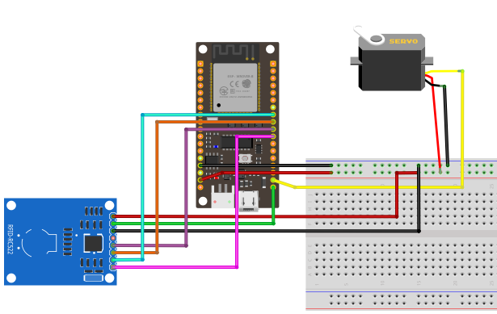
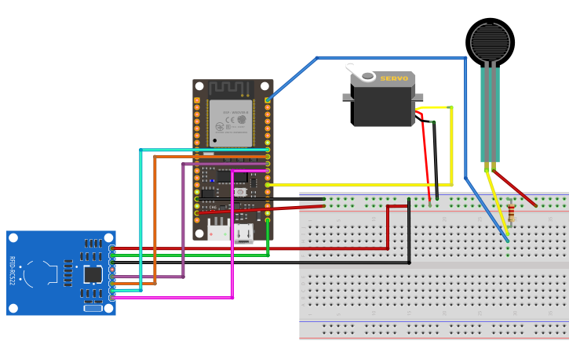

# Proyecto C.A.T.S.
Este sistema ha sido desarrollado para la asignatura **Descripción de Sistemas Hardware** de 1º del MUII de la UEX usando tres dispositivos programados con Arduino y un servidor central programado en NodeJs. A continuación se detallarán algunos aspectos como el concepto, funcionamiento o instalación del proyecto.

## Concepto principal
Este sistema tiene como propósito realizar una vigilancia automatizada sobre las necesidades de las mascotas, priorizando los gatos al ser compatibles con todos los dispositivos desarrollados. Los gatos pueden entrar por la puerta, comer y hacer sus necesidades en la caja de arena, pero cada una de estas acciones requiere algo de atención por parte del dueño para que sean realizadas correctamente. 

Cada uno de los componentes presentados a continuación tiene como meta automatizar hasta cierto punto estas necesidades del gato sin necesidad de tanta atención por parte de su cuidador.

## Componentes
El primer componente es la puerta, que detecta mediante un sensor RFID conectado a una placa Firebeetle ESP32 el identificador del gato que se acerca y le abre el paso usando un servo para accionar el mecanismo.



El segundo componente es el comedero, que se encarga de liberar comida si se acerca una mascota con un identificador para el sensor RFID conectado a otra placa Firebeetle ESP32, accionando el mecanismo del servo para liberar la comida si lleva suficiente tiempo sin comer para no engordarlo. Con el sensor de fuerza conectado, se detecta si hay suficiente comida para cerrar el paso de la comida.



El tercer componente es la caja de arena, que mediante un sensor de metano detecta si se han producido defecaciones cerca y emite un pitido para que el dueño sepa que tiene que recoger los restos.


El cuarto componente es un servidor central programado con NodeJs que se encarga de responder a las peticiones de los dispositivos para que sepan la información de los gatos que hay para que actúen en consecuencia.

## Ejecución
Los tres archivos de configuración Arduino se pueden escribir en los esquemas correspondientes usando **Arduino IDE**, abriendo los ficheros con el programa y usando la opción **Upload** con el dispositivo que se quiera usar conectado.

Para desplegar el servidor central, es necesario tener instalado **NodeJs** en el sistema y usar los comandos en terminal:
```sh
sudo node express.js
./uploadServer.sh 80
```